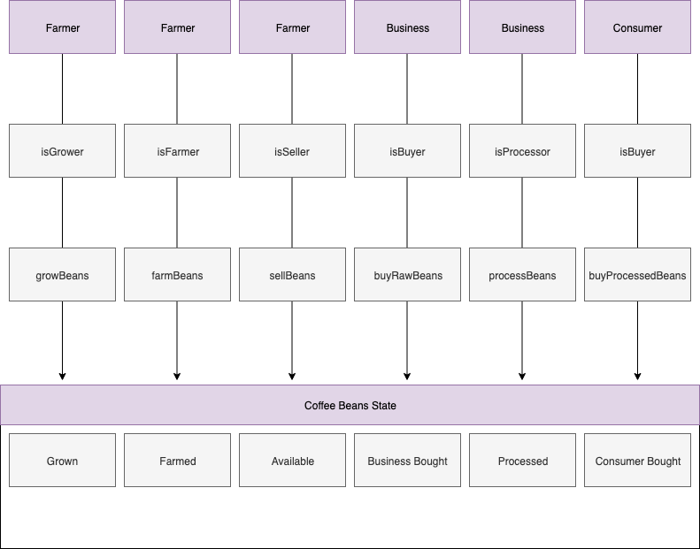
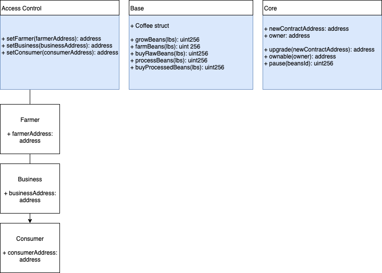

# PROJECT WRITE_UP

## TABLE OF CONTENTS

- [Unified Modeling Language](#unified-modeling-language)
- [Libraries](#libraries)

## UNIFIED MODELING LANGUAGE

The following images represent a brief overview of the processes, modeling, and state of the DApp. First, here is an example of the sequence diagram for the coffee cycle:

## LIBRARIES

In this project, I'll be using the following libraries to build out my DApp:

- `Truffle` - Used for its extensive abilities as a framework and also for testing
- `Web3` - Used due to its excellent ability to connect to the EVM network
